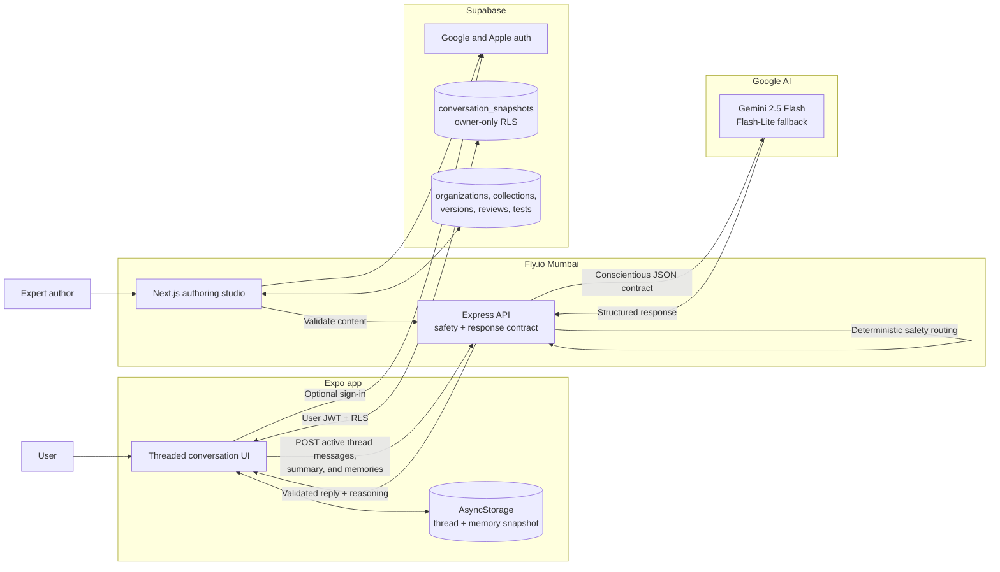
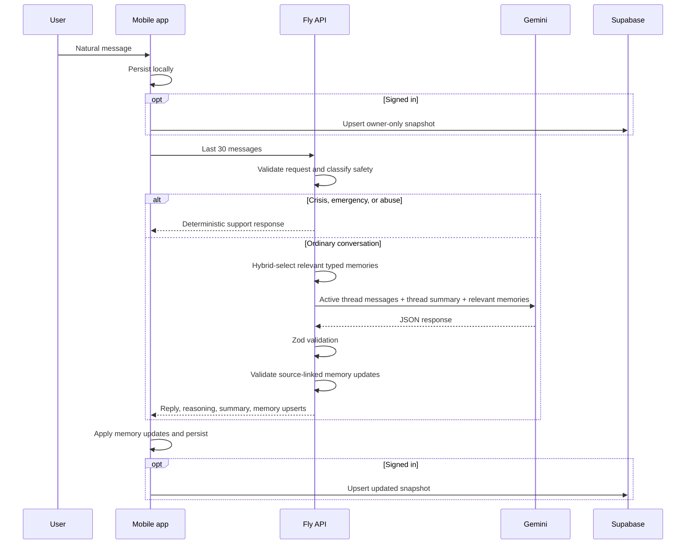
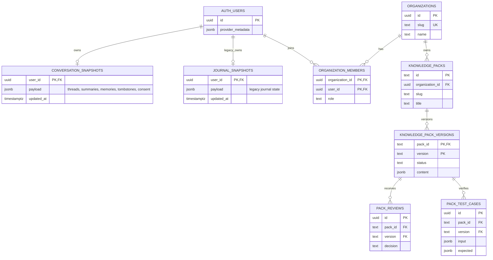

# Within Architecture

**Current as of:** 28 July 2026

Within is transitioning from journal analysis to conscientious conversation. The
new conversation path is implemented. Legacy journal code and data remain in the
repository during migration but are no longer part of the mobile experience.

## System



## Conversation Flow



## Response Contract

Every model response is validated as:

```text
reply
stance: support | explore | challenge | escalate
knownFacts[]
interpretations[]
missingContext[]
directChallenge
followUpQuestion
```

The natural reply is always visible. The mobile UI exposes the structured fields
under "Why this response?" so users can inspect how fact, inference, uncertainty,
and challenge were separated.

The current contract is a generation constraint, not a proof that the reasoning is
correct. Evaluation cases and deterministic grounding checks are required before
the system can make strong longitudinal claims.

## Data Model



## Trust Boundaries

| Component | Conversation access | Authoring access | Main control |
| --- | --- | --- | --- |
| Mobile app | Local state and signed-in user's snapshot | None | User JWT and owner-only RLS |
| Authoring studio | None | Member organization's content | Organization RLS and workflow RPCs |
| Fly API | Messages explicitly submitted for a response | Published content and validation | Server-only provider keys |
| Gemini | Bounded messages supplied for one request | None currently | Prompt contract and provider settings |
| Supabase | Stored snapshots and authored content | Stores workflow state | RLS, guarded RPCs, delete cascade |

The studio has no query or policy granting authors access to user conversations.

## Deliberately Retained

- Supabase Google and Apple authentication
- Owner-only snapshot sync
- Account deletion
- Fly deployment and health checks
- Gemini provider and fallback handling
- Deterministic crisis routing
- Versioned authoring workflow
- Legacy journal endpoint and tables during migration

## Durable Memory

The app stores multiple conversation threads for the user, but sends only the
active thread's latest 20 messages for generation. Each thread has its own bounded
rolling summary. Cross-thread typed memories cover people, relationships, goals,
unresolved situations, commitments, predictions, outcomes, and corrections.

The client owns the memory snapshot. The API does not maintain a hidden user-memory
database. For each request:

1. deterministic hybrid retrieval ranks at most 100 supplied memories using the
   latest message, active thread summary, subject matches, lexical overlap, status,
   confirmation, and memory-type priority, then selects up to 12 records;
2. Gemini receives only those records, the active thread summary, and recent
   messages from that thread;
3. proposed memory updates require source user-message IDs;
4. the API rejects invented sources, unknown update IDs, and changes to
   user-confirmed memories;
5. the client deduplicates and applies at most six updates;
6. users can inspect, correct, or delete the active thread summary and global typed
   records.

Conversation sync remains an owner-only JSON snapshot. Version 2 migrates the
legacy single transcript into one thread. Thread deletion creates a tombstone, and
cloud writes merge the latest remote snapshot before upsert so another device does
not casually overwrite or resurrect threads.

Memory is still fallible. The next architectural work is grounding and
anti-sycophancy evaluation, automatic follow-up on commitments and predictions,
and expert-authored conversational skills.
